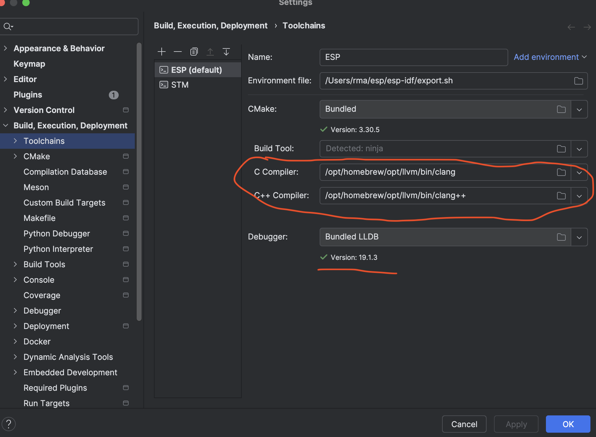

**************************
TBD Development on Mac
**************************

Desktop build needs latest llvm compiler.

Install command line tools (CLT) for Xcode:

.. code-block:: shell

        xcode-select --install

Install Homebrew:

.. code-block:: shell

    /bin/bash -c "$(curl -fsSL https://raw.githubusercontent.com/Homebrew/install/HEAD/install.sh)"

Install llvm:

.. code-block:: shell

    brew install llvm

Set the path to the llvm compiler:

.. code-block:: shell

    export PATH="/opt/homebrew/opt/llvm/bin:$PATH"
    export CC=/opt/homebrew/opt/llvm/bin/clang
    export CXX=/opt/homebrew/opt/llvm/bin/clang++

Set custom llvm in CLion:

