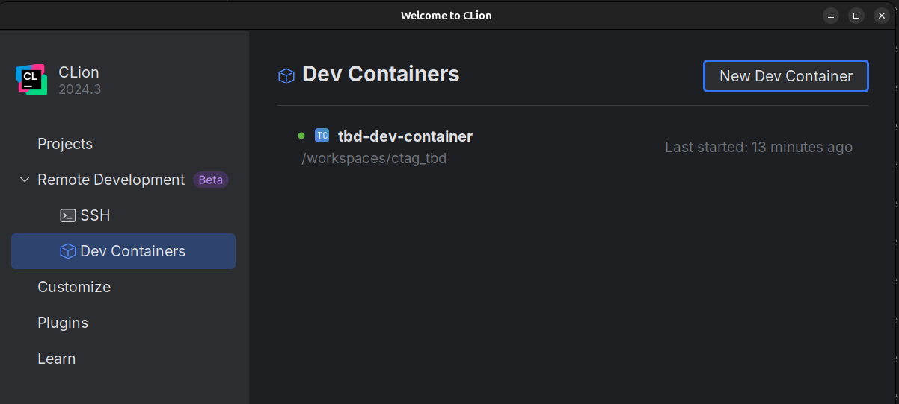
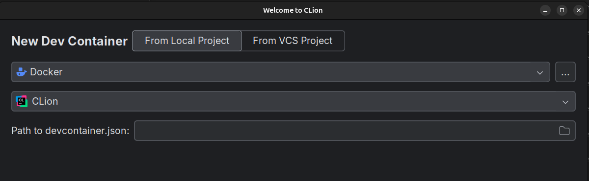
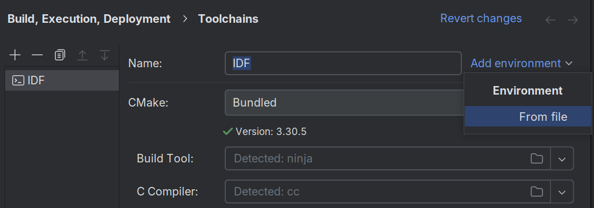
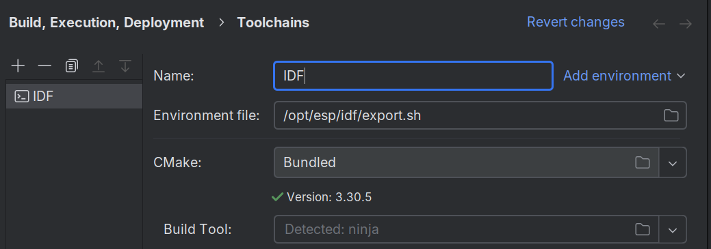
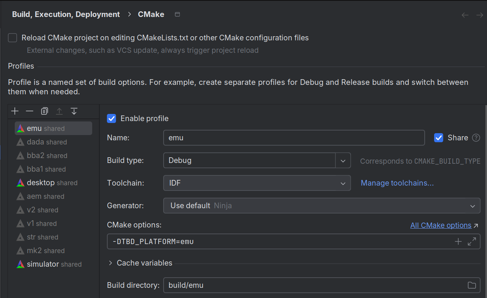

*******************************
Building and Debugging in CLion
*******************************

The following describes setting up CLion for TBD development using the dev container.
There are some steps required when opening the project for the very first time:

- selecting dev container as known project and building
- setting up the embedded tool chain
- defining some build profiles for the TBD platforms you want to work with

Building and Launching the Dev Container
========================================

On the project selection screen of CMake navigate to ``Remote Development > Dev Containers``

After selecting ``New Dev Container`` you will have to switch to the ``From Local Project``
tab and select the ``.devcontainers/devcontainer.json`` file in the TBD root dir.

After selecting ``Build Container and Continue`` the container is build and the project
will be opened in CLion.

Setting up the Build Profiles
=============================

To configure the esp32 toolchain required to build the embedded firmware 
open the CMake settings and navigate to ``Build, Execution, Deployment > Toolchains``.
Rename or create a toolchain named ``IDF`` (or some other identifiable name).

Select ``Add Environment > From file``

Enter ``/opt/esp/idf/export.sh`` and apply settings.

Finally in ``Build, Execution, Deployment > CMake`` create some profiles. If the TBD variant
is a firmware select your ``IDF`` toolchain for those targets. Note that if no CMake profiles can be created
one has to right click on CMakeLists.txt from within the CLion IDE in the project tree and **reload CMake project**.

Make sure to set ``Build Directory`` to ``build/platform_name`` and add 
``-DTBD_PLATFORM=platform_name`` to ``CMake Options``.

CLion will automatically run CMake and depending on which platforms you have configured 
in the target dropdown of the main view you should find

- ``ctag-tbd.elf`` for firmware platforms
- ``tbd_app_desktop`` for the desktop platform
- ``tbd_app_simulator`` for the simulator platform

.. warning:: 

    The esp32 toolchain dependency manager causes some trouble when platforms with USB
    and platforms without USB are active at the same time.