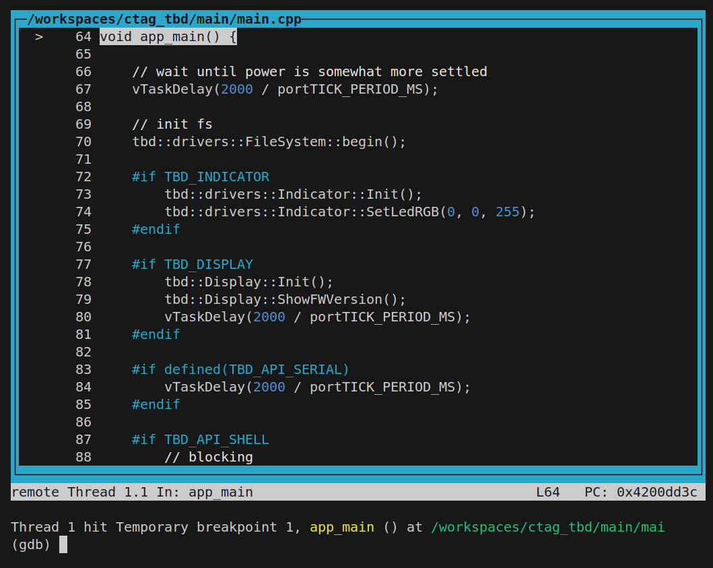

*********
Emulation
*********

.. warning:: 
    The emulator provided in the current esp32 toolchain does not support the psiram and
    memory capabilities API running TBD needs. The dev container therefore contains its
    own build of the latest esp32 qemu. Trying to use the qemu provided by installing 
    ESP IDF will most likely fail.

Emulation supports running and debugging code in an esp32 environment.

Run the TBD emulator using the `tbe` tool from the project directory

.. code-block:: shell

  tbe --refresh

.. note:: 
  To terminate the emulator use ``ctrl-a`` followed by ``x``

The ``emu`` platform uses ``esp32s3`` as its architecture. Make sure to use the 
``xtensa-esp32s3-elf-gdb`` GDB debugger.

To halt on boot and wait for a debugger to connect on port `:1234` use the `--debug` 
argument:

.. code-block:: shell

  tbe --refresh --debug

To start GDB in command line mode and connect to the emulator use

.. code-block:: shell

  gdb-emu

This starts firmware initialization and pauses reaching the `app_main` entrypoint, you 
should be greeted with something similar to

.. note::

  Make sure to run the `tbe` tool from the project root directory.

Emulator Features and limitations
=================================

The main use cases for the emulator are

- verifying that changes to non platform specific code does not impact the esp32 port
- debuging esp32 specific port code

The debugger runs the *emu* target that is is a fully functional esp32 TBD with some minor
limitations, differences:

- network support is provided through an ethernet rather than a wifi interface
- CVs and audio are processed in the sound loop in a mocked form with no way to in our 
  output sound
- the watchdog timer (WDT) is disabled to not get in the way of debugging

However some of the things the emulator does provide are

- debugging of hardware independent code
- profiling of processing performance
- profiling of memory usage
- complete running TBD firmware
- running audio loop/processing
- network communication
- serial communication
- flash storage
- file system storage
- non volatile storage 

tbe Tool Reference
==================

The ``tbe`` tool will always use the ``emu`` TBD platform. If ``--refresh`` or ``--build-only``
options are present it will also ensure the software build is up to date and all required
files are present, by performing the following steps

- configuring the ``emu`` target build if not configured
- building the ``emu`` platform if required
- merging all binaries into a final binary for emulation ``build/emu/quemu_flash.bin``
- create a new efuse binary ``build/emu/quemu_efure.bin`` if none present

Unless the ``--build-only`` option is present, ``tbe`` will start the emulator

Arguments
---------

All unknown arguments are passed to the qemu emulator.

``--silent`` do not show processing output
  The processing steps generate a lot of output. To hide this output set this flag.

``--refresh`` ensure all files are build and up to date
  If not set no checks and updates are performed.

``--build-only`` only perform refresh
  Same as ``--refresh`` without starting emulator.

``--debug`` start emulator after boot and wait for ``xtensa-esp32s3-elf-gdb`` debugger on 
  port ``:1234``
