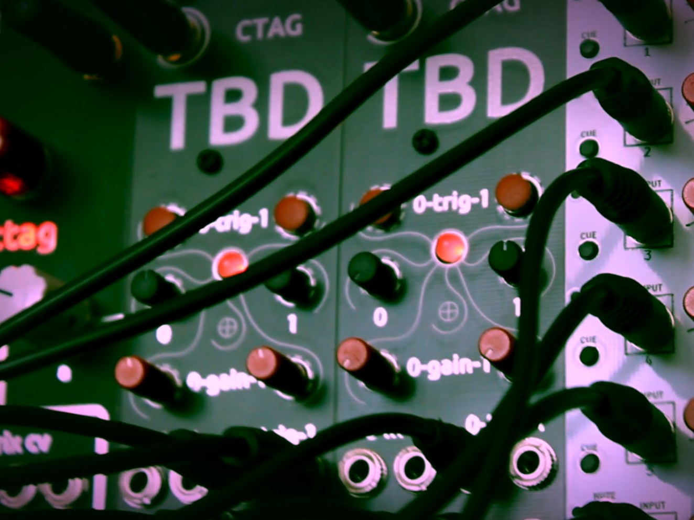

#################################
CTAG TBD hackable audio processor
#################################

Hardware reference designs and sof

tware suite for a series of highly hackable electronic musical devices, built around the 
**ESP32** family of systems on a chip (SoC).

Everything to build your own audio processor device for MIDI or Eruorack. Add sounds and plugins, extend, hack, redesign 
- all the freedom you need!

    eierlegende Wollmilchsau

    *an all-in-one device or person which has (or claims to have) only positive attributes and which can (or attempts to) 
    do the work of several specialized tools*
    
    --wiktionary.org

What is CTAG TBD
================

**TBD** is the latest iteration in family of musical tools and instruments based on versatile cheap system on a chip (SoC) 
commonly used in *Internet of Things* devices.

The `CTAG <https://www.creative-technologies.de/>`_ project was started as a space to explore technology for creative use
with a strong emphasis on music and sound. It aims at creating usable creative tools and devices, exploring upcoming 
technolgies for creative playful use and foster students creative potential. CTAG is both an idea and also a real lab at the 
*University of Applied Science Kiel (FH Kiel)*. CTAG has seen many different contributors and projects over the years, from
educators to volunteers to students, from class attendees to large contributors to projects like TBD.

How to Use
==========

The bare minimum required to get started is:

- one of the required ESP32 development boards
- the desired TBD device reference circuit board (PCB)
- a web browser that supports `Web Serial <https://developer.mozilla.org/en-US/docs/Web/API/Web_Serial_API#browser_compatibility>`_  

After installing the default software onto the device you are ready to explore the default plugins, play with the settings
and make some music.

Ready to Build Devices
----------------------

CTAG TBD MIDI
    play notes from digital MIDI input

CTAG TBD Eurorack
    play notes from input voltages

    .. youtube:: QjYHxz9g3Kc

CTAG Strämpler https://github.com/ctag-fh-kiel/ctag-straempler
    eurorack sample streaming and sound synthesis module  

    .. youtube:: zmj8tKPHV8g

Creating Custom Sounds
----------------------

To create your own plugins you should have some basic understanding of the C++ programming language. The TBD software suite
provides you with a plugin system, so you do not have alter any of the core software to create new sounds. To create new
sound plugins you will need:

- the TBD source code (preferably using GIT version management)
- the ESP32 development tools *or* the docker container engine installed

Extending the Hardware
----------------------

If you are familiar with basic electronics, the TBD reference PCB has a spare free spare connector for every 
input/output (used and unused) of the ESP32 development board. Even without a complete redesign of the reference board, 
this allows you to:

- connect analyzers (oscilloscope or logic analyzer)
- use an additional bread board, to wire up some additional chips and components
- design a hat PCB, to plug be plugged on top of the ESP32 board

.. toctree::
    :hidden:
    :caption: About
    :maxdepth: 2
    :glob:

    about/*

.. toctree::
    :hidden:
    :caption: Get Started
    :maxdepth: 2
    :glob:

    get_started/*

.. toctree::
    :hidden:
    :caption: Sound Library
    :maxdepth: 2
    :glob:

    sound_library/*

.. toctree::
    :hidden:
    :caption: Create Plugins
    :maxdepth: 2
    :glob:

    create_plugins/*

.. toctree::
    :hidden:
    :caption: Core Development
    :maxdepth: 2
    :glob:

    core_development/*

Indices and tables
==================

* :ref:`genindex`
* :ref:`modindex`
* :ref:`search`
