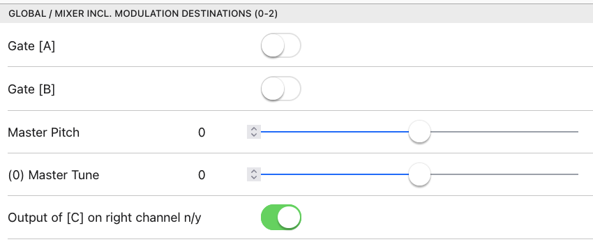

*******************
Freakwaves (Stereo)
*******************

Description
-----------

*Freakwaves* provides a synth based on two wavetable-oscillators with
different CV/Gate inputs for their notes. In result it can be played
duophonically, but there also is a third oscillator that either can be
used as a sub oscillator for oscillator two or to generate a third line
of notes resulting on the other two inputs. All notes can optionally be
scale-corrected. Depending on the two streams of notes coming in, as
well as the sound of the synth as whole the overall sound can change.
These possible interferences in combination with the wavetable sound
sources is why the plugin is called "Freakwaves". The nature of the
sound can be changed very variably with the built in resonator, which is
as well from various Mutable Instruments modules. To get an idea what
can be done with these generative features and effects, you may listen
here: https://soundcloud.com/taitekatto/freakwaves-for-tbd

.. Note::
      *Freakwaves* features 3 voices and can drive two outputs,
      but everything will be mixed to the left output, unless you explicitly
      set the output of voice C to the right output:

Parameters
==========

Section 1: Global / Mixer incl. Modulation Destinations (0-2)

-  Gate [A]

-  Gate [B]

-  Master Pitch

-  (0) Master Tune

-  Output of [C] on right channel n/y

-  Pitch Quantize [A] modulation only <-> mod and input

-  Quantization Scale [A], 0==off

-  Pitch Quantize [B] modulation only <-> mod and input

-  Quantization Scale [B], 0==off

-  Quantization Scale [C], 0==off

-  Glide [A] off/on

-  Glide Time [A]

-  Glide [B] off/on

-  Glide Time [B]

-  Glide [C] off/on

-  Glide Time [C]

-  Volume [A]

-  Volume [B]

-  Volume [C]

-  (1) Volume External in

-  External Signal Dry<=>Wet

-  (2) Balance [A/B/Ext] <=> [C]

-  Master Volume

| Section 2: Oscillators incl. Modulation Destinations (3-8)
| [Osc C will be generated via logical operations on A and B]

-  Source Wavetable A

-  (3) Scan Wavetable A

-  (4) Pitch A

-  Tune A (also offset for quantisation of input, if activated!)

-  Source Wavetable B

-  (5) Scan Wavetable B

-  (6) Pitch B

-  Tune B (also offset for quantisation of input, if activated!)

-  [Sub B/Result A/B] Wavetable C

-  (7) Scan Wavetable C

-  (8) Tune C (Osc B or Modifier Logic)

Section 3: Logical Connective

-  Generate pitch for OSC C off/on

-  Generate (C) via A==B<->A!=B

-  If logic A!=B choose for C: A<->B

-  Trigger C only if Gate from A or B n/y

-  Select Gate for C: A <-> B

Section 4: Modifiers

-  External Mod (C) off/on

-  Frequ-Mod Speed (C)

-  Frequ-Mod Amount (C)

-  External Mod Gain

-  Amount of External Mod (C)

-  External Signal modifies: FrequMod<->Release (C)

-  Accent Mod (C) off/on

-  Accent Level of output

-  Amount of Accent Mod (C)

-  Accent to: Bend<->Wavescan (C)

-  Keytrack Mod (C) off/on

-  Keytracking (C) to Effect (Delaytime/Resonator Structure)

-  Keytracking slew limiter off/on

-  Keytracking (C) to: Resonator<->Delay

Section 5: Volume Envelope (for OSC A,B,C)

-  Volume EG [A] off/on

-  Slow Envelope [A] n/y

-  Attack [A]

-  Decay [A]

-  Sustain [A]

-  Release [A]

-  Volume EG [B] off/on

-  Slow Envelope [B] n/y

-  Attack [B]

-  Decay [B]

-  Sustain [B]

-  Release [B]

-  Volume EG [C] off/on

-  Slow Envelope [C] n/y

-  Attack [C]

-  Decay [C]

-  Sustain [C]

-  Release [C]

Section 6: Delay incl. Modulation Destinations (9-11)

-  Delay off/on

-  Delay after Resonator n/y

-  (9) Delay Dry<=>Wet

-  Shorten Delay Times to 0.5 seconds n/y

-  (10) Delay Time (max. 0.5 or 2 Sec.)

-  (11) Delay Feedback

Section 7: Resonator incl. Modulation Destinations (12-17)

-  Resonator off/on

-  (12) Resonator Dry<=>Wet

-  (13) Drive Amount

-  Resonator Position

-  (14) Resonator Frequency

-  (15) Resonator Structure

-  (16) Resonator Brightness

-  (17) Resonator Damping

Section 7: 7 LFOs, Types->0)SINE 1)SQUARE 2)SINE LOW 3)SINE HI 4)TRI LOW
5)TRI HI 6)S&H / Dest->Global:0)Tune 1)ExtIn 2)Mix A:3)Scan 4)Pitch
B:5)Scan 6)Pitch C:7)Scan 8)Tune Delay:9)Wet 10)Time 11)Feed Reso:12)Wet
13)Drive 14)Freq 15)Struct 16)Bright 17)Damp

-  Enable LFO 1 n/y

-  Destination LFO 1

-  Type LFO 1

-  Modulation Speed LFO 1

-  Modulation Intensity LFO 1

..

-  Enable LFO 2 n/y

-  Destination LFO 2

-  Type LFO 2

-  Modulation Speed LFO 2

-  Modulation Intensity LFO 2

-  …

Usage / Patch Ideas
-------------------

If you set up a new sound from scratch, it’s a good idea to turn
up volumes of the componentes one by one, to see what happens per
voice.

For instance you could start with the volume only turned up for
OSC A in the “Global Section”.

Normally the patches/play options will be driven by
*Freakwaves’s* main building blocks, for instance:

-  Turn off the volume envelope[s] to get droning sounds

-  Modify those drones via the resonator and/or Delay

-  Use the Delay before *or* after the Resonator

-  Changing the pitch of the third voice via “Relative Tune C”

-  Use a short envelope when used with faster sequences

-  Use Sample&Hold from the LFO to change the colour and/or pitch
      of an oscillator

-  Use a slow sine-LFO to “morph” the colour (wavetable scan) of
      an oscillator

-  Use various scales for OSC A, B, C

-  Use slow sinewave LFOs for pitch modulation along with scale
      correction

-  Scale correct incoming notes

-  Play OSC C with the gate of B but the pitch and envelope of A
      (for instance)

-  When using the modifier logic only play back/record the output
      of the third voice

-  Put out OSC C on the right output and treat it with other
      modules/effects from there

A typical, yet quite special use of *Freakwaves* could be to have
a sequence driving the first voice (OSC A) and play along to this
improvised with the second voice (OSC B) while a third melody is
generated via the third voice (OSC C). Along with that you can modify
the sound via various controls, for instance via the resonator. Because
the modifiers also react differently, depending on the frequency
spectrum and the loudness of the third voice this can be used as a kind
of feedback-mechanism while playing along.

*Setting of CV/Gate:*

For the use-case described above, be sure to map the following
parameters from the GUI: “Gate [A]”, “Gate [B]”, “Pitch A” and “Pitch
B”.

*Scale quantisation of input:*

Please note that jitter of incoming CV may cause note-glitches if
scale-correction of the input is selected. For that reason *Freakwaves*
has a built-in dejitter feature that automatically is enabled in this
context. To adjust possible offsets of scale-corrections, please use the
tune-parameter for oscillator A and/or B. Detuning then is ignored, but
still possible for OSC C.

*Content needed:*

Please be aware that you have to make sure that wavetables are
loaded to the TBDs ROM space, in order to make proper use of
*Freakwave*. In order to use the sample rom, you can upload from the
edit sample rom page of the web-GUI. Either use your own wavetables or
the factory content (sample-rom.tbd) as explained here: factory
sample
`data <https://github.com/ctag-fh-kiel/ctag-tbd/blob/master/sample_rom/readme.md>`_