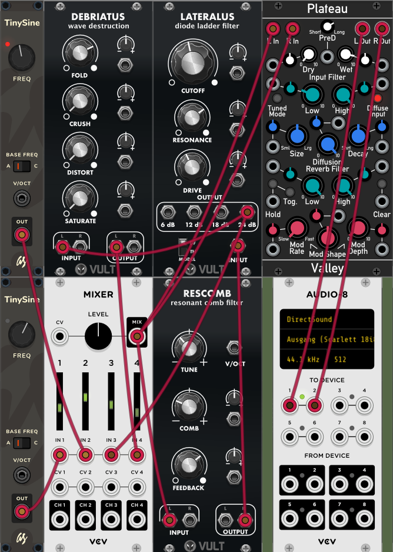

*******************
Retroactor (Stereo)
*******************

**Description**
~~~~~~~~~~~~~~~

.. warning:: 
      Please be careful when using high resonance-levels of the filter or
      high feedback-levels.**

As typical for a diode-ladder filter and feedback-experiments the
sound can become quite nasty, so be sure to try with low volumes
first!
*Please note:* Retroactor does not offer real stereo processing but
the feedback processing needs many resources, so it still takes up
both slots of the TBD.
Here is a little demo-track done only with Retroactor with quite a bit
of reverb added in the DAW:
https://soundcloud.com/taitekatto/retroactor-for-tbd

The idea of Retroactor is to have a simple yet flexible to control
feedback / drone-noise generator.The plugin uses a wavefolder, as
diode-ladder filter and a resonant combfilter by Carlos Laguna Ruiz
implemented in his VULT language, for more details on the topic please
look here: https://github.com/modlfo/vult
Retroactor’s signal-flow is visualized downwards from the top to the
bottom of the GUI.
Because of the feedback structure this yet may be not entirely
obvious. Here is a screenshot of a very similar patch, also using
VULT-technology, done in VCV Rack to make it more obvious:

**Parameters**
~~~~~~~~~~~~~~

Section 1: Global

-  Master Pitch (map CV here if desired)

-  Master Tune +- 1200 Cent

-  Master Volume

Section 2: Voice

-  Pitch smooth Sine A (Sine A is a pure Sine, very smooth - for
      overtones consider Sine B)

-  Smooth Sine A +-1 Octave

-  Distort Sine B n/y (This will give you a Sine wave with more
      overtones due to aliasing)

-  Pitch variable Sine B (Sine B can be rougher, beware of
      unwanted scratchy sounds, though)

-  Variable Sine B +-1 Octave

Section 3: Feedback Loop

-  ResetFeedbackLoop (Click here, if the feedback has stopped and
      you want to restart it)

-  Combfilter Cutoff

-  Combfilter Resonance

-  Combfilter Tone

-  Diode Ladder Cutoff

-  Diode Ladder Resonance

-  Vintage Resonance pitching n/y

-  Wavefolder Amount

-  Isolate Feedback-Loop n/y (Sinewaves will be excluded from the
      feedback-line)

Section 4: Mixer

-  Disable Sinus Waves n/y (Shut off sinewaves)

-  VolSineBoost (Decrease or up to triple loudness increase the
      volume of the waves)

-  Vol smooth Sine A (Sine A is a pure Sine, very smooth - for
      overtones distort Sine B)

-  Vol variable Sine B (Sine B can be rougher, beware of unwanted
      scratchy sounds, though)

-  Sinewaves Mix

-  Vol Feedback Loop

-  Vol Wavefolder

.. _usage-patch-ideas-8:

**Usage / Patch Ideas**
~~~~~~~~~~~~~~~~~~~~~~~

Please note that if you want to make use of Retroactor’s feedback
capabilities you have to feed the feedback-loop with some kind of signal
(sine waves and/or filter-feedback) first.

The general idea here is, then to find some “sweet spots” where
the feedback and the distortion sounds interesting and then play around
with some parameters in a way that makes sense in the (musical) context
you want to use it.
It’s a good idea to use lots of reverb and maybe also echo and/or some
kind of modulation like a phaser. In the VCV Rack screenshot above for
instance, the module Plateau got used.
