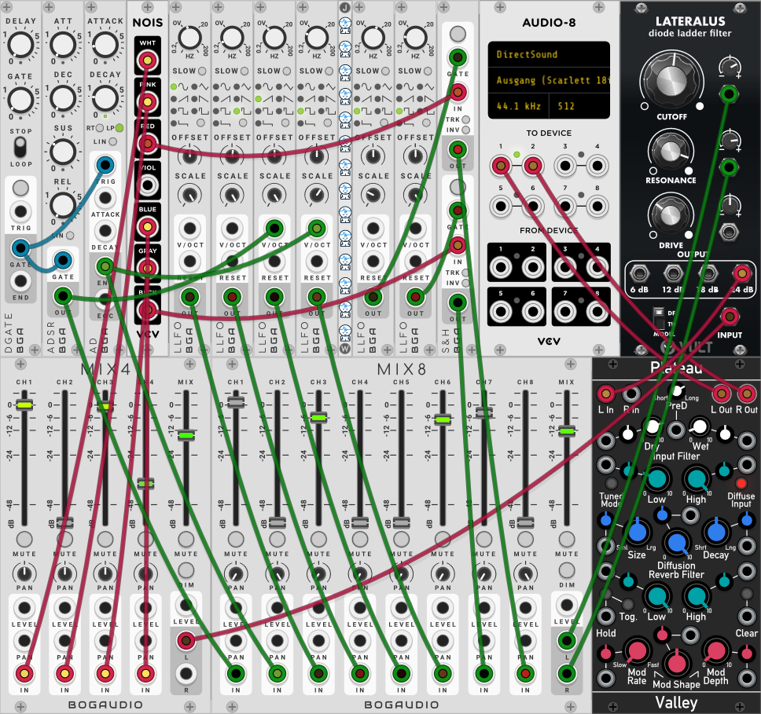

****************
SpaceFX (Stereo)
****************

**Description**
~~~~~~~~~~~~~~~

| **Please be careful when using high resonance-levels of the filter.**
| As typical for a diode-ladder filter the sound can become quite nasty,
  so be sure to try with low volumes first! *Please note:* SpaceFX
  offers real stereo processing for the reverb only.
| Here is a little demo-track done with SpaceFX with quite a bit of
  reverb added in the DAW:
| https://soundcloud.com/taitekatto/spacefx-for-tbd

The idea of SpaceFX is to have a simple yet flexible to control white
noise and modulated filter self oscillation generator. SpaceFX among
other things tries to pay tribute to early space-rock bands like Gong,
Hawkwind, Far East Family Band and others. But also the Radiophonic
Workshop and electronic works by Ligeti or modern glitchy or
soundscape-oriented stuff comes to mind. A major inspiration being Tim
Blake's usage of the VCS 3 for such "space noises".

The plugin uses a diode-ladder filter and a sawwaves oscillator by
Carlos Laguna Ruiz implemented in his VULT language, for more details on
the topic please look here: https://github.com/modlfo/vult VCV-Rack
prototype for SpaceFX using a similar VULT-filter:

**Parameters**
~~~~~~~~~~~~~~

Section 1: Global

-  Trigger/Gate Envelopes

-  Master Pitch (map CV to Cutoff here if desired)

-  Master Tune +- 1200 Cent

-  Filter key tracking (Pitch-CV to Cutoff)

-  Volume before Effects

Section 2: Voice / Noise

-  Enable Noise n/y

-  Noise Colour (Pink to White)

-  Noise Level

-  Modulate Noise n/y

-  Noise Colour Mod Speed

-  Noise Colour Mod Amount

-  Noise Level Mod Speed

-  Noise Level Mod Amount

Section 3: Voice / Filer

-  Enable Pitch to Cutoff n/y

-  Cutoff Frequency

-  Resonance

-  Use vintage resonance tuning n/y

-  Cutoff Modulation Level (EGs+SOU+LFOs)

-  Resonance Modulation Level (EGs+SOU+LFOs)

-  Amplitude Modulation Level (EGs+SOU+LFOs)

Section 3: AD Envelope

-  AD envelope active n/y

-  AD envelope modifies VCA level n/y

-  AD Attack

-  AD Decay

-  AD envelope loop n/y

-  AD volume envelope invert n/y

-  AD envelope cutoff amount

-  AD envelope resonance amount

-  AD to Saw LFO speed n/y

-  AD to Saw LFO speed amount

Section 4: ADSR Envelope

-  ADSR envelope active n/y

-  ADSR envelope modifies VCA level n/y

-  ADSR Attack

-  ADSR Decay

-  ADSR Sustain

-  ADSR Release

-  ADSR volume envelope invert n/y

-  ADSR envelope cutoff amount

-  ADSR envelope resonance amount

-  ADSR to Sine LFO speed n/y

-  ADSR to Sine LFO speed amount

Section 5: SOU - Source of Uncertainty (SnH1: Whitenoise-Based, SnH2:
Pinknoise-based)

-  SAMPLE AND HOLD LFO 1 active n/y

-  Sample n' Hold 1 frequency

-  Sample n' Hold 1 cutoff level

-  Sample n' Hold 1 resonance level

-  Sample n' Hold 1 AM level

-  Sample n' Hold 1 to Frequ. of SnH-1

-  Sample n' Hold 1 to Frequ. of Square LFO

-  Sample n' Hold 1 to AD Attack

-  SAMPLE AND HOLD LFO 2 active n/y

-  Sample n' Hold 2 frequency

-  Sample n' Hold 2 cutoff level

-  Sample n' Hold 2 resonance level

-  Sample n' Hold 2 AM level

-  Sample n' Hold 2 to Frequ. of SnH-1

-  Sample n' Hold 2 to Frequ. of Pulse/Tri LFO

-  Sample n' Hold 2 to AD Decay

Section 6: LFO Modulation Mixer (Cutoff, Resonance and Amplitude
Modulation)

-  SINE LFO active n/y

-  Sine frequency

-  Sine LFO cutoff level

-  Sine LFO resonance level

-  Sine LFO AM level

-  Pulse LFO active n/y

-  Pulse frequency

-  Pulse Width

-  PWM speed

-  PWM Oddness factor

-  Pulse/Tri LFO cutoff level

-  Pulse/Tri LFO resonance level

-  Pulse/Tri LFO AM level

-  SAW LFO active n/y

-  Sawtooth frequency

-  Sawtooth LFO cutoff level

-  Sawtooth LFO resonance level

-  Sawtooth LFO AM level

-  SQUARE LFO active n/y

-  Square frequency

-  Squarewave LFO cutoff level

-  Squarewave LFO resonance level

-  Squarewave LFO AM level

Section 7: Delay

-  Delay active n/y

-  Shorten Delay Times to 0.5 seconds n/y

-  Delay Time (max. 0.5 or 2 Sec.)

-  Delay Feedback

-  Delay Dry/Wet

Section 8: Reverb (Set to Mono if you want to use only one output of the
TBD)

-  Reverb active n/y

-  Mono Reverb n/y

-  Reverb Input Gain

-  Reverb Diffusion

-  Reverb Time

-  Reverb Lowpass

-  Reverb LFO 1

-  Reverb LFO 2

-  Reverb Dry/Wet

.. _usage-patch-ideas-9:

**Usage / Patch Ideas**
~~~~~~~~~~~~~~~~~~~~~~~

There are various main modes of operation:

a) “Space Noises” using modulated self-oscillating filter tones
      only

b) Like (a) but also involving noise, filter tones can be
      self-oscillating but don’t have to

c) Using AM for Ring Modulator kind of tones

d) Like (a) and/or (b/c) but with an volume envelope applied

e) Using vast Echo and/or reverb for soundscapes

f) Making use of the cross-modulation options of the EGs and SnH
      LFOs to generate self-playing patches. A typical Todd Barton
      inspired Krell patch like explained here by himself is possible:
      https://vimeo.com/48466272

The general idea here is, then to find some “sweet spots” where
the “Space Noises”sound interesting and then play around with some
parameters in a way that makes sense in the (musical) context you want
to use it. The filter also may be played via CV/Gate by a keyboard, thus
becoming an oscillator on its own.
VCV Rack was used for prototyping, as you can see in the screenshot
above, the module Plateau got used, whereas SpaceFX uses a Mutable
Instruments Reverb plus a simple yet (literally) effective
feedback-delay line.

.. _section-7:
