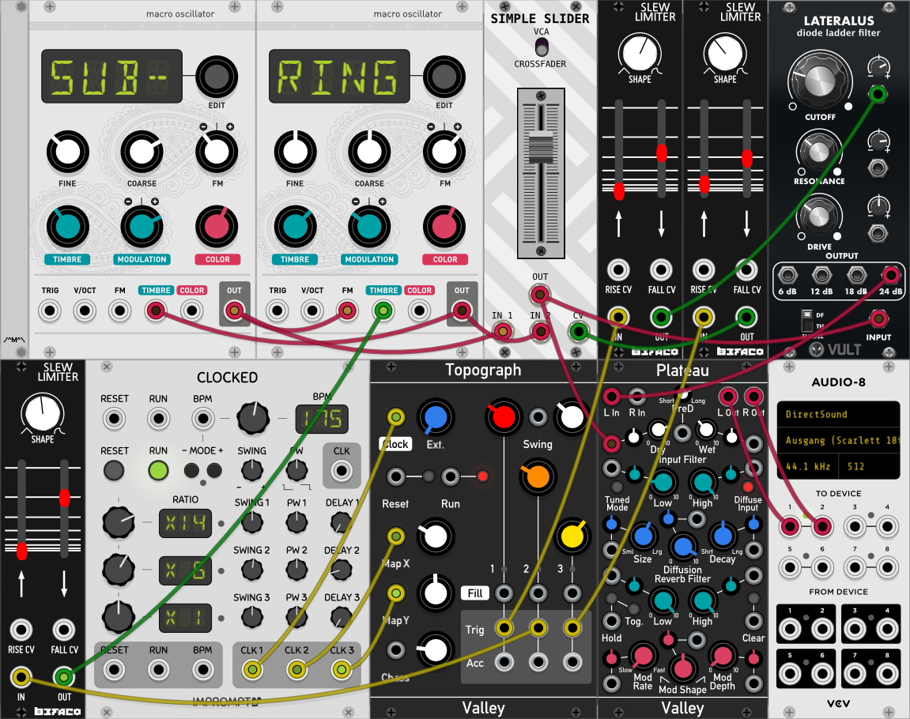

******************
Subbotnik (Stereo)
******************

**Description**
~~~~~~~~~~~~~~~

.. warning:: 
  Please be careful when using high resonance-levels of the filter

As typical for a diode-ladder filter the sound can become quite nasty,
so be sure to try with low volumes first! *Please note:* Subbotnik
does not provide true stereo processing, but the resources of this
mode are needed for the filterbank in vocoder-mode.
Here is a little demo-track done with Subbotnik with quite a bit of
reverb added in the DAW:
https://soundcloud.com/taitekatto/subbotnik-for-tbd

Subbotnik originates as a term for a volunteer workday on a Saturday in
the Soviet Union, also known under that name in the former DDR / Eastern
Germany. TBD-Subbotnik uses "Eastcoast" building-blocks in a more
"Westcoast"/Buchla-synths inspired way. Its name is meant as a play on
words, paying tribute to Morton Subotnick composer and friend of Don
Buchla, famous for his composition "Silver Apples of the Moon", using a
Buchla 100, said to be the first electronic work available on record to
the public.

One aspect of this way to sculpt the sounds by adding overtones is the
optional cross modulation of one Macro-oscillator modulating different
aspects of a second Macro-oscillator. Another more Westcoast approach is
to have many random modifiers and the option to use one EG in a lowpass
gate inspired fashion.

Among other things Subbotnik uses two clones of Mutable Instruments
Braids and examples for the VULT-language by Carlos Laguna Ruiz, used
with the filter design here. For more details on those topics please
look here: https://mutable-instruments.net/modules/braids and here
https://github.com/modlfo/vult

Subbotnik is an extended version of the first row of modules as
prototyped in VCV Rack:

Two macro oscillators can modulate each other, but Subbotnik also
offers 10 LFOs with 7 different waveforms, including S&H. These
modulators can modify almost every aspect of the soundengine by using
selectable destinations. 5 of those LFOs also can target time /
frequency related parameters including the first 5 LFOs. It's actually
much easier to use than to explain!

.. _parameters-9:

**Parameters**
~~~~~~~~~~~~~~

Section 1: Global

-  Gate Oscillators and Envelopes

-  Master Volume

-  (0) CrossFade MacOsc A <=> MacOsc B (ID 0 for modulation destination)

Section 2: MacOsc A (incl. LFO Destinations 1-4)

-  Enable MacOsc A n/y

-  Shape A

-  (1) Volume A

-  (2) Coarse Pitch (V/Oct - C1:0, C1#:100...C5:60000) A

-  Fine Tune +- 1200 Cent A

-  (3) Timbre A

-  (4) Color A

-  Enable CrossModulation from Osc B n/y

-  AM xModA Amount A

-  Frequency xModB Factor A

-  Frequency xModB Amount A

-  Timbre xModB Amount A

-  Color xModB Amount A

Section 3: MacOsc B (incl. LFO Destinations 5-8)

-  MacOsc_B (incl. LFO Destinations 5-8)

-  Enable MacOsc B n/y

-  Shape B

-  (5) Volume B

-  (6) Coarse Pitch (V/Oct - C1:0, C1#:100...C5:60000) B

-  Fine Tune +- 1200 Cent B

-  (7) Timbre B

-  (8) Color B

-  Enable CrossModulation from Osc B n/y

-  AM xModA Amount B

-  Frequency xModA Factor B

-  Frequency xModA Amount B

-  Timbre xModA Amount B

-  Color xModA Amount B

Section 4: Low Pass Filter (please note: some MacOsc “Shapes” force the
SVF type)

-  Filter enable n/y

-  Diode Ladder <=> State Variable Filter type

-  (9) Filter Drive / Wavefolder Amount

-  (10) Cutoff Frequency

-  Resonance

-  AD EG Filter amount

Section 5: AD EG (Note: for a 'lowpass Gate' kind of EG please set the
Filter's Cutoff Frequency and EG-amount to your liking first)

-  Enable AD-EG n/y

-  AD-EG to Volume+Filter <=> Filter (Filter must be set
      accordingly!)

-  (16) Attack AD-EG

-  (17) Decay AD-EG

-  Loop AD-EG while Gate is active n/y

Section 6: Volume ADSR EG

-  Enable Volume ADSR-EG n/y

-  Attack Volume ADSR-EG

-  Decay Volume ADSR-EG

-  Sustain Volume ADSR-EG

-  Release Volume ADSR-EG

| Section 7: LFO Types:
| 0)SINE 1)SQUARE 2)SINE LOW 3)SINE HI 4)TRI LOW 5)TRI HI 6)S&H /
  Destination: 0)Xfade 1)Vol_A 2)Pitch_A 3)Timbre_A 4)Color_A 5)Vol_B
  6)Pitch_B 7)Timbre_B 8)Color_B 9)Drive 10)Cutoff

-  Enable LFO 1 n/y

-  Destination LFO 1

-  Type LFO 1

-  (11) Modulation Speed LFO 1

-  Modulation Intensity LFO 1

-  Enable LFO 2 n/y

-  Destination LFO 2

-  Type LFO 2

-  (12) Modulation Speed LFO 2

-  Modulation Intensity LFO 2

-  Enable LFO 3 n/y

-  Destination LFO 3

-  Type LFO 3

-  (13) Modulation Speed LFO 3

-  Modulation Intensity LFO 3

-  Enable LFO 4 n/y

-  Destination LFO 4

-  Type LFO 4

-  (14) Modulation Speed LFO 4

-  Modulation Intensity LFO 4

-  Enable LFO 5 n/y

-  Destination LFO 5

-  Type LFO 5

-  (15) Modulation Speed LFO 5

-  Modulation Intensity LFO 5

| Section 8: LFOs++ Types:
| 0)SINE, 1)SQR 2)SINE LOW 3)SINE HI 4)TRI LOW 5)TRI HI 6)S&H / Dest:
  0)Xfade 1)Vol_A 2)Pitch_A 3)Timbre_A 4)Color_A 5)Vol_B 6)Pitch_B
  7)Timbre_B 8)Color_B 9)Drive 10)Cutoff 11)LFO1 12)LFO2 13)LFO3 14)LFO4
  15)LFO5 16)AD-Attack 17)AD-Decay

-  LFO++ 1 active n/y

-  Destination LFO++ 1

-  Type LFO++ 1

-  Modulation Speed LFO++ 1

-  Modulation Intensity LFO++ 1

-  LFO++ 2 active n/y

-  Destination LFO++ 2

-  Type LFO++ 2

-  Modulation Speed LFO++ 2

-  Modulation Intensity LFO++ 2

-  LFO++ 3 active n/y

-  Destination LFO++ 3

-  Type LFO++ 3

-  Modulation Speed LFO++ 3

-  Modulation Intensity LFO++ 3

-  LFO++ 4 active n/y

-  Destination LFO++ 4

-  Type LFO++ 4

-  Modulation Speed LFO++ 4

-  Modulation Intensity LFO++ 4

-  LFO++ 5 active n/y

-  Destination LFO++ 5

-  Type LFO++ 5

-  Modulation Speed LFO++ 5

-  Modulation Intensity LFO++ 5

.. _usage-patch-ideas-10:

**Usage / Patch Ideas**
~~~~~~~~~~~~~~~~~~~~~~~

In order to have Pitch-CV/Gate connected in a traditional way,
you should assign the Gate/Trigger to “Gate” in the Global section and
Pitch-CV to “Coarse Pitch A” and “Coarse Pitch B” of both Oscillator
sections in parallel. This gives you 5 octaves (0-5V) of range for 60
notes / 5 octaves. But of course you could change the pitch of one
oscillator “by hand” with a knob or even with the browser GUI instead.

In principle, already one of Subbotnik’s two macro-oscillators is
powerful enough to serve as the soundsource of the module, because
effectively it’s a clone of Mutable Instrument’s Braids. To use it as a
Westcoast inspired complex oscillator any of the macro-oscillators can
work as a modulator or a carrier, even at the same time. In addition the
macro-oscillators’ parameters volume, pitch, timbre and color can be
destinations for more traditional LFOs. The random speed modulators are
somewhat inspired by the Buchla’s ‘Source of Uncertainty’ in a way that
they can function as tempo-modifiers for the AD-EG and the first five
LFOs. The AD-EG can be used as a filter-EG and thus behave similar to a
Westcoast style lowpass gate. In loop-mode variations of the AD-EG times
can lead to complex rhythmic patterns. The AD-EG can be kind of
overlayed by the ADSR-EG. The loop-mode of the AD-EG will only work as
long as the gate is on, looping will also retrigger the
Macro-oscillators, which is important for some oscillators/soundsources,
which are called shapes with Braids. (See shapes 28-36, including
physical-model based ones below.)

By looking at the presets provided and given the fact that the
signal-pass mainly is symbolized from top to bottom you should be able
to find many useful applications of Subbotnik.

*The waveforms or so-called shapes per Macro-oscillator are as
follows per ID:*

00 CSAW

01 MORPH

02 SAW_SQUARE

03 SINE_TRIANGLE

04 BUZZ

05 SQUARE_SUB

06 SAW_SUB

07 SQUARE_SYNC

08 SAW_SYNC

09 TRIPLE_SAW

10 TRIPLE_SQUARE

11 TRIPLE_TRIANGLE

12 TRIPLE_SINE

13 TRIPLE_RING_MOD

14 SAW_SWARM

15 SAW_COMB

16 TOY

17 DIGITAL_FILTER_LP

18 DIGITAL_FILTER_PK

19 DIGITAL_FILTER_BP

20 DIGITAL_FILTER_HP

21 VOSIM

22 VOWEL

23 VOWEL_FOF

24 HARMONICS

25 FM

26 FEEDBACK_FM

27 CHAOTIC_FEEDBACK_FM

28 PLUCKED

29 BOWED

30 BLOWN

31 FLUTED

32 STRUCK_BELL

33 STRUCK_DRUM

34 KICK

35 CYMBAL

36 SNARE

37 WAVETABLES

38 WAVE_MAP

39 WAVE_LINE

40 WAVE_PARAPHONIC

41 FILTERED_NOISE

42 TWIN_PEAKS_NOISE

43 CLOCKED_NOISE

44 GRANULAR_CLOUD

45 PARTICLE_NOISE

46 DIGITAL_MODULATION

47 QUESTION_MARK

.. _section-8:
