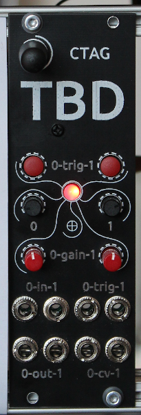

# **CTAG TBD >>to be determined<<**




## Documentation:
- [User's Manual](doc/CTAG%20TBD%20User's%20Manual.md)
- [Summary table of all available plugins.](doc/TBD%20Plugin%20Overview.md)
- [Tutorial videos in YouTube playlist](https://www.youtube.com/playlist?list=PLB5iCbhcvJ2qdD7s1o9wsvQ9qtsCUWVLR)

## Update procedure
Easiest way to update is to use the ready made [releases from github](https://github.com/ctag-fh-kiel/ctag-tbd/releases).
Flash the ctag-tbd.bin and storage.bin from the TBD web ui (within the configuration menu).
Alternatively you can connect a USB cable to the TBD and use the serial flasher from esp idf (see how to flash below).
In order to use the sample rom, you can upload from the edit sample rom page [factory sample data](sample_rom/readme.md) (sample-rom.tbd).

## What it is:
- The eierlegende Wollmilchsau (German for swiss army knife) audio processing module.
- Offering already more than 50 high quality audio generators and effects.
- Open source Eurorack sound module based on the ESP32.
- With an easy to extend audio plugin architecture.
- What you make it.

## Why it is:
- A group of audio enthusiasts enjoying coding and hardware making.
- Build a platform to learn, build and practise skills, and engage students.
- To allow anyone to understand technology by offering open access.
- To squeeze and optimize code so that it can work on a small embedded system.
- Because we can.
- To fight boredom and despair of Corona Virus!

## Features:
- More than 50 high quality audio generators and effects.
- Easy DSP plugin development.
- Sample ROM playback and wavetable oscillator with user wavetables from sample ROM [details here](sample_rom/readme.md)
- Simulator for cross platform plugin development without hardware module (speeds up plugin development, better code verification).
    - Check description [here](simulator/readme.md)
- [Cloud compiler](https://fxwiegand.github.io/tbd-cloud-compiler/) to build firmwares with plugin subsets, allows to optimize sample-rom size (NOTE: Binaries from **cloud compiler** can be **flashed only through serial connection**!)
- With web UI user interface by wireless browser access.
- Through a REST-API.

## Version log
[See here...](versions.md)

## Potential new features / current limitations / work to be done:
- More plugins.
- VULT support.
- Bug identification and fixing.
- Code refactoring to make things more beautiful.
- More user friendly interaction.
- Documentation / tutorials.
- Your ideas?

## How to engage yourself:
- Join the [enthusiastic developer](https://codewithoutrules.com/2018/11/12/enthusiasts-vs-pragmatists/) team on Github.
- Help build and spread the hardware module (and the word).
- Help documenting.
- More ideas?

## How to build
**NEW!!!** You can build custom firmwares with plugin subsets and to increase sample-rom using the [cloud compiler](https://fxwiegand.github.io/tbd-cloud-compiler/).
No need for a toolchain on your own system.

For developing your own plugins / make TBD yours, you need C/C++ skills.
You may want to check the [TBD simulator](simulator/readme.md) for easy plugin development without TBD hardware.

You can build the firmware using a Github action. Just fork the ctag-tbd repo to your Github account and enable the supplied
Github action. Enter the Github actions menu and select e.g. the "draft-release" action. Click the "Run workflow" button. 
Upon successful completion, your binaries will be available as .zip archive as output of your run.

If you prefer to have a dev environment on your own, install espressif esp-idf, instructions are [here](https://docs.espressif.com/projects/esp-idf/en/latest/esp32/index.html).
Then clone the ctag-tbd repo with all dependencies and build firmware with cmake.
Firmware release v1.0.0 was build with ESP-IDF 5.1.1 release.

### Devcontainers
Devcontainers allow users to develop in an isolated container, with all the
dependencies installed and with the features of an IDE. Currently there are two
methods supported.

Currently both devcontainers are using [release/v4.4](https://github.com/espressif/esp-idf/tree/release/v4.4) version of [esp-idf](https://github.com/espressif/esp-idf)
#### Gitpod
Gitpod offers free online workspaces, just by pressing this button, you'll have
access to a development environment for ctag-tbd in a browser tab:
[](https://gitpod.io/github.com/ctag-fh-kiel/ctag-tbd)
#### VsCode Devcontainers
Visual Studio Code also offers [developing inside a Container](https://code.visualstudio.com/docs/remote/containers),
but for this approach, the user will need to install:
- [Visual Studio Code](https://code.visualstudio.com/download)
  - [Remote - Container Extension](https://marketplace.visualstudio.com/items?itemName=ms-vscode-remote.remote-containers)
- [Docker](https://docs.docker.com/get-docker/)

Open the repository folder with Visual Studio Code and open the container, there are several ways to open the container:
- When opening Visual Studio Code, a popup will come up asking to open reopen the folder in a Container, click `Reopen in Container`
- Open the Command Palette and select `Remote-Containers: Reopen in Container`
- Use the open in a remote window button on the bottom left corner to `Reopen in Container`

By default, the image will be pulled from [esp-idf-env](https://hub.docker.com/r/sergiogasquez/esp-idf-env), but users can also build
it from the Dockerfile by editing the [`.devcontainer.json`](https://github.com/ctag-fh-kiel/ctag-tbd/blob/master/.devcontainer/devcontainer.json#L3-L10)
### tbd cloud compiler
The [tbd cloud compiler](https://fxwiegand.github.io/tbd-cloud-compiler/) allows you to reduce the size of the ctag-tbd firmware, therefore making up more free space for your samples, by removing one or multiple plug-ins that you don't want to use with your module via a web ui. It makes use of GitHub actions running in your own forked repository and therefore doesn't depend on any toolchain installed on your own system. For more information take a look at the [user guide](https://fxwiegand.github.io/tbd-cloud-compiler/user-guide).

## How to flash
Either use the binaries available from the [releases at github](https://github.com/ctag-fh-kiel/ctag-tbd/releases) to flash through the TBD's web ui.

Or use [ESP Tool](https://github.com/espressif/esptool) to flash through a USB connection with your PC (check [this script](bin/flash.sh)).

If you have [ESP IDF](https://github.com/espressif/esp-idf) installed (the whole development environment), use:
```sh
idf.py flash monitor
```
