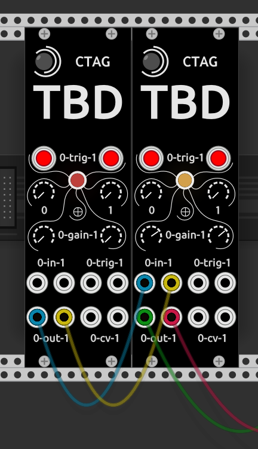

# tbd4vcv --> TBD as plugin for [VCV Rack](https://vcvrack.com/).


## Binaries for Rack v1 instructions
- For Mac, Windows and Linux binaries are released with TBD firmware releases
- Place the .zip in the plugins-v1 folder of your Rack installation
- Start Rack and place an instance of tbd4vcv
- Open a web browser and enter http://localhost:3000 to access TBDs web UI
- Add another tbd4vcv instance and ctrl-click it in Rack, map the web UI to the current instance by checking "Enable Web Server -> Active"
- Reload http://localhost:3000 to access the web UI of the current instance
- Note that you have to store the patches in TBDs web UI in order for them to be recalled upon patch load in Rack

## Known issues / limitations
- Config data and sample rom upload not working at this point
- Favorites not supported at this point
- To include your own sample rom data, use TBDs edit sample rom page and use compile + download to PC, replace the file sample-rom.tbd in Racks plugins-v1/tbd4vcv/sample_rom folder with your file (sample-rom.tbd file name needs to be maintained)
- tbd4vcv may be incompatible with older Mac OSX versions due to the need for c++17 requirements (outdated stdlibc++)

## Build instructions Rack v1 plugins
You can build the plugins from source steps are: 
```shell 
    wget https://vcvrack.com/downloads/Rack-SDK-1.1.6.zip
    unzip Rack-SDK-1.1.6.zip
    cd Rack-SDK
    export RACK_DIR=`pwd`
    cd ..
    git clone --recursive https://github.com/ctag-fh-kiel/ctag-tbd.git
    cd ctag-tbd/tbd4vcv
    mkdir build && cd build
    cmake ..
    cpack
```
Note that for Windows you have to manually collect all files and zip them, example see [here](cibuild-win-msys2mingw-win64.sh)